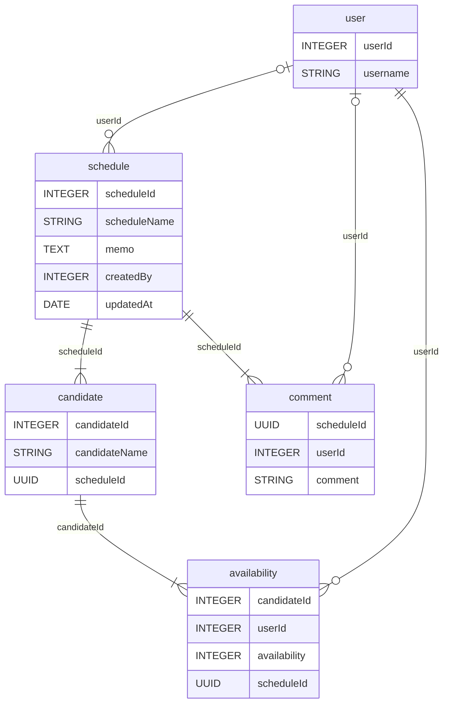
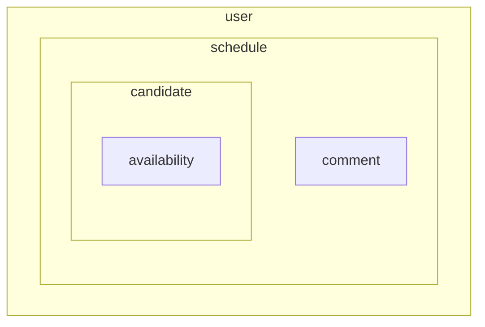

# mermaid-test

### ER 図のつもり

```mermaid
erDiagram
	user |o--o{ schedule : userId
	user |o--o{ comment : userId
	user ||--o{ availability : userId
	schedule ||--|{ candidate : scheduleId
	schedule ||--|{ comment : scheduleId
	candidate ||--|{ availability : candidateId
	
	user {
	INTEGER userId
	STRING username
	}

	schedule {
	INTEGER scheduleId
	STRING scheduleName
	TEXT memo
	INTEGER createdBy
	DATE updatedAt
	}

	candidate {
	INTEGER candidateId
	STRING candidateName
	UUID scheduleId
	}

	availability {
	INTEGER candidateId
	INTEGER userId
	INTEGER availability
	UUID scheduleId
	}

	comment {
	UUID scheduleId
	INTEGER userId
	STRING comment
	}
```

---

### データ作ったり消したりする順番メモ

```mermaid
	graph TB

subgraph user
	subgraph schedule
		subgraph candidate
			availability
		end
	comment
	end
end
 
```
